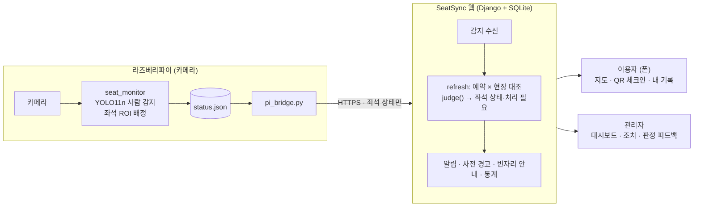

# SeatSync — 열람실 좌석 예약 × 실제 이용 대조 서비스

[](https://github.com/yugh27194/SeatSync/actions/workflows/tests.yml)

공공도서관·스터디카페 열람실에서 **예약 기록**과 카메라가 감지한 **실제 착석 상태**를 대조해,
사석화(짐만 두고 장시간 이석)·이탈·무단 점유(예약 없이 사용) 같은 문제 좌석을 찾아 관리자에게 알리고,
이용자에게는 예약·체크인·빈자리 알림·사전 경고를 제공하는 **Django 기반 웹서비스**입니다.

> 시스템은 **표시하고 알릴 뿐**, 제재·조치는 관리자가 결정합니다. 영상·얼굴 데이터는 저장하지 않습니다.

---

## 1. 기획

### 문제
- 예약 시스템에는 "예약됨"으로 나오지만 실제로는 **짐만 두고 몇 시간째 비어 있는 자리**(사석화)가 많다.
- 반대로 **예약 없이 앉아 있는 사람**(무단 점유) 때문에 예약한 사람이 자리를 쓰지 못한다.
- 관리자는 열람실을 계속 돌아보지 않는 한 어느 자리가 문제인지 알기 어렵다.

### 목표
1. 예약 정보와 실제 좌석 상태를 **자동으로 대조**해 문제 좌석을 좌석 단위로 표시한다.
2. 이용자가 **폰만으로** 예약·체크인(좌석 QR)·연장·반납할 수 있게 한다.
3. 문제가 되기 **전에 본인에게 사전 경고**하고, 관리자는 상황에 맞는 조치를 버튼으로 처리한다.
4. 혼잡도·실사용률을 측정해 운영 판단에 쓴다.

### 설계 원칙
- **개인정보 최소화**: 카메라 영상은 라즈베리파이 안에서만 처리하고, 웹은 좌석 번호와 상태만 받는다. 얼굴 인식·녹화 없음.
- **판정 로직은 순수 함수**(`judge()`): DB·시각에 의존하지 않아 모든 경우를 테스트로 검증한다.
- **기준값은 코드에 고정하지 않음**: 좌석 배치는 `config/seats.json`, 시간 기준은 관리자 설정 화면.
- **모바일(360px) 우선**: QR을 찍으면 폰 브라우저로 바로 열린다.
- **확인 불가는 빈자리가 아니다**: 카메라가 끊기면 마지막 상태를 유지하고 시간 기반 판정을 보류한다.

### 시스템 구성



- 감지 프로토타입: [Seojieun05/SKKU_MakerHackerton](https://github.com/Seojieun05/SKKU_MakerHackerton) — 연동 설계는 [docs/DATA_FLOW.md](docs/DATA_FLOW.md)
- 카메라 연동 전이나 카메라가 없는 좌석은 관리자가 좌석 상태를 **임시로 부여**해 운영할 수 있다.

---

## 2. 좌석 상태와 판정

좌석 상태는 **빈자리 / 사용중 / 사용불가** 세 가지이고, 각각 세부 상태를 가진다. `!`는 **처리 필요**(관리자 모드에서만 보임).

| 좌석 상태 | 세부 상태 |
|---|---|
| **빈자리** | 빈자리 |
| **사용중** | 이용 중 · 입실 대기 · 착석(체크인 전) · 잠시 자리 비움 · **짐만 있음** · ! 무단 점유 · ! 체크인 누락 · ! 이탈 · ! 사석화 |
| **사용불가** | 고장 · 점검·청소 · 사용 중지 · ! 예약 좌석 사용불가 |

**예약 × 현장 대조 규칙**

| 예약 \ 현장 | 비어 있음 | 사람 있음 | 짐만 있음 |
|---|---|---|---|
| 없음 | 빈자리 | ! 무단 점유 (관리자 확인 시 이용 중) | ! 무단 점유 (관리자 확인 시 짐만 있음) |
| 입실 전 | 입실 대기 | ! 체크인 누락 (관리자 확인 시 착석) | ! 체크인 누락 |
| 이용 중 | 잠시 자리 비움 → 30분 초과 **! 이탈** | 이용 중 | 짐만 있음 → 30분 초과 **! 사석화** |

- 예약 좌석이 사용불가가 되면 ! 예약 좌석 사용불가, 체크인 제한(15분)을 넘기면 **미입실**로 자동 취소.
- 이탈·사석화 기준 **10분 전**에 본인에게 **사전 경고**, 처리 필요로 넘어가면 다시 알림.
- 자리 비움 시간은 체크인 이후부터 세며, 카메라 감지가 끊긴 동안에는 이탈·사석화로 넘기지 않는다.

**운영 기준값 (기본값, 관리자 화면에서 변경)**

| 항목 | 기본값 | 항목 | 기본값 |
|---|---|---|---|
| 체크인 제한 | 15분 | 기본 이용 시간 | 120분 |
| 이탈 기준 | 30분 | 연장 | 60분씩, 종료 30분 전부터, 최대 2회 |
| 사석화 기준 | 30분 | 사전 경고 시점 | 기준 10분 전 |
| 빈자리 안내 유지 | 5분 | 정지 권장 경고 수 · 기본 정지 기간 | 3회 · 3일 |

---

## 3. 주요 기능

| 이용자 | 관리자 (관리자 모드) |
|---|---|
| 20석 **좌석 지도**에서 예약, 지금 혼잡도 | 문제 좌석 `!` 표시(유형별 색)와 **처리 필요 목록** |
| **좌석 QR** 체크인·바로 예약 (원격 체크인 방지 토큰) | 좌석별 **세부 상태 부여**(카메라 없을 때 임시 배분) |
| 연장·반납·관리자 호출, 남은 시간 카운트다운 | 상황별 조치: 현장 배정·퇴실 안내·대리 체크인·좌석 이동·강제 반납·짐 수거 |
| **빈자리 알림 대기** (구역 선택, 5분 우선 예약) | **예약 대조 표**, 처리 이력(누가·언제·무엇을) |
| **내 이용 기록**: 일/주/월 이용 시간, 연장·반납 이력 | **판정 피드백**(맞음/틀림) → 카메라·수동 판정 **정확도** |
| **혼잡도 히트맵** (요일×시간) | 이용자 **사전 경고·경고·이용 정지** |
| 🔔 **사전 경고**·처리 필요 전환·빈자리 안내 알림 | 혼잡도 + **실사용률·유휴 점유** 측정, **카메라 연결 상태** |

- 관리자 계정은 따로 없다. 로그인 후 상단 **[관리자] 스위치**를 켜고 관리자 코드를 입력하면 관리자 모드가 된다.
- 자세한 기능 설명: [docs/FEATURES.md](docs/FEATURES.md)

---

## 4. 구현 요약

- **Django 5.2 + SQLite**, Django 템플릿 + 바닐라 JS(3초 polling), 순수 CSS. 빌드 도구 없음.
- 모든 요청마다 한 트랜잭션에서 `refresh()` 파이프라인 실행: 미입실·만료 정리 → 전 좌석 `judge()` → 전이 기록 → 처리 필요 알림(전이 시 생성·자동 해소) → 본인 사전 경고 → 빈자리 안내.
- 동시 예약은 SQLite `BEGIN IMMEDIATE` + 활성 예약 유일 제약으로 하나만 성공.
- 보안: Django 인증·CSRF, 좌석 QR 토큰 상수 시간 비교, 관리자 코드 5회 실패 시 잠금, 디바이스 키.
- 라즈베리파이 감지 프로토타입의 `status.json`(schema_version 1)을 그대로 받는 수신기와 Pi용 브리지(`tools/pi_bridge.py`).
- 테스트 135개(pytest), GitHub Actions에서 실행.

| 문서 | 내용 |
|---|---|
| [docs/FEATURES.md](docs/FEATURES.md) | 화면별 기능 상세 |
| [docs/ARCHITECTURE.md](docs/ARCHITECTURE.md) | 구조·데이터 모델·판정 로직·파이프라인·보안·테스트 |
| [docs/API.md](docs/API.md) | API 목록과 에러 코드 |
| [docs/DATA_FLOW.md](docs/DATA_FLOW.md) | 라즈베리파이 감지 프로토타입 연동 데이터 플로우 |
| [docs/DEPLOY.md](docs/DEPLOY.md) | 외부 링크 공유(Cloudflare 터널)·상시 배포(PythonAnywhere) |

---

## 5. 실행

```bat
python -m venv .venv
.venv\Scripts\activate                     :: macOS/Linux: source .venv/bin/activate
pip install -r requirements.txt
python manage.py init_db                   :: DB 생성 + 좌석 20석·설정·테스트 계정
python manage.py runserver 0.0.0.0:5000
```

브라우저: `http://localhost:5000` · 같은 Wi-Fi의 폰: `http://<PC의 IP>:5000`

| 계정 | 비밀번호 | 관리자 코드 |
|---|---|---|
| `userA` / `userB` / `userC`, `20260001`~`20260005` | `1234` | `admin` (환경변수 `SEATSYNC_ADMIN_CODE`로 변경) |

| 명령 | 설명 |
|---|---|
| `python manage.py demo` | 시연 상황 배치 (정상·이탈·사석화·무단 점유·체크인 누락·사용불가·미입실 등) |
| `python manage.py demo_history` | 지난 4주 샘플 이력 (내 기록·혼잡도 시연용) |
| `python manage.py serve` | 외부 공유용 서버(waitress)로 실행 |
| `python manage.py init_db --reset` | DB를 지우고 새로 만들기 |
| `python -m pytest` | 테스트 |
| `python tools/make_qr.py --base-url http://<주소>` | 좌석 QR 이미지 + 인쇄용 페이지 |

**외부 링크로 공유**: `share.bat` 실행 → `https://….trycloudflare.com` 주소 공유 / 상시 배포는 PythonAnywhere
(`bash deploy/pythonanywhere_setup.sh`) — [docs/DEPLOY.md](docs/DEPLOY.md)

### 환경변수

| 이름 | 기본값 | 설명 |
|---|---|---|
| `SEATSYNC_ADMIN_CODE` | `admin` | 관리자 모드 코드 (외부 공개 시 추측하기 어려운 값 권장) |
| `SEATSYNC_SECRET_KEY` | 개발용 값 | Django 세션·CSRF 서명 키 |
| `SEATSYNC_DEVICE_KEY` | `dev-key` | 라즈베리파이 인증 키 |
| `SEATSYNC_DB` | `seatsync.db` | SQLite 파일 경로 |
| `SEATSYNC_TZ` | `Asia/Seoul` | 표시용 타임존 |
| `SEATSYNC_ADMIN_MODE_MIN` | `60` | 관리자 모드 유지 시간(분) |
| `SEATSYNC_TRUSTED_ORIGINS` | – | 외부 배포 주소 추가 허용(쉼표 구분) |
| `SEATSYNC_HTTPS` | `0` | HTTPS 전용 호스팅이면 `1` |

---

## 6. 좌석 배치 (20석)

`config/seats.json` — 폰에서도 좌석 칸이 충분히 크도록 세로형 5열.

```
[          창   문          ]
 A-1  A-2  A-3  A-4  A-5        창가 1인석            ← 카메라 cam1 (A01~A09)
 B-1  B-2   ┆   C-1  C-2
 [테이블]    통   [테이블]         4인 테이블 ×2
 B-3  B-4   로   C-3  C-4                              ← 카메라 cam2 (A01~A11)
 D-1  D-2   ┆   D-3  D-4        칸막이 1인 집중석
 E-1  E-2  E-3  [ 사물함 ]       노트북석(콘센트)
[출입문]          [안내데스크]
```

좌석마다 번호(`no`), 라벨, 위치, 구역, 카메라 대응(`camera_id` + calibrate 순서 `camera_seat`), 초기 상태를 적는다.

---

## 7. 프로젝트 구조

```
seatsync/   Django 설정 (settings.py, urls.py, wsgi.py)
seats/      핵심 앱 — status.py(판정) · services.py(파이프라인) · analytics.py(통계) · models.py · views/ · auth.py
templates/ static/   화면 · CSS/JS
config/seats.json    좌석 배치·카메라 대응
tools/      pi_bridge.py(라즈베리파이→웹) · make_qr.py · simulate.py(가짜 감지)
deploy/     PythonAnywhere 배포 스크립트
docs/       기능·구현·API·데이터 플로우·배포 문서
tests/      pytest
share.bat / share.sh   외부 링크 공유(Cloudflare 터널)
```

## 8. 범위 밖

카메라 영상 수신·저장·스트리밍, 얼굴·개인 식별, 결제, 외부 로그인(SSO), 이메일·문자·휴대폰 푸시(알림은 웹 화면에서 표시), 여러 열람실 동시 운영.
