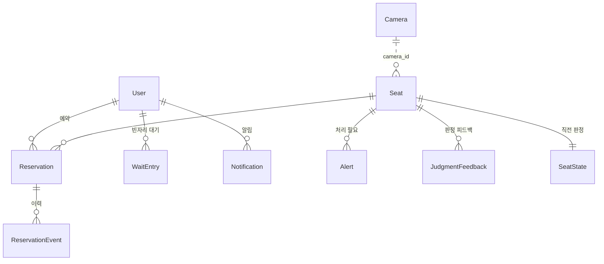
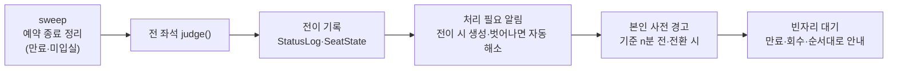

# SeatSync 구현 설명

Django 기반 웹서비스로 구현했다. 이 문서는 구조, 데이터 모델, 판정 로직, 주요 기능의 동작 방식을 설명한다.

## 1. 기술 스택

| 영역 | 사용 기술 | 선택 이유 |
|---|---|---|
| 서버 | **Python 3.10+ · Django 5.2** | 인증·세션·CSRF·ORM·마이그레이션을 기본 제공 |
| DB | **SQLite** (Django ORM, `transaction_mode=IMMEDIATE`) | 설치 없는 단일 파일 DB, 쓰기 트랜잭션 직렬화로 동시 예약 경합 방지 |
| 화면 | Django 템플릿 + **바닐라 JS** + 순수 CSS | 빌드 도구 없이 폰(360px)부터 동작, 3초 polling |
| 실행 | `runserver`(개발) / **waitress**(외부 공유) / PythonAnywhere WSGI(상시 배포) | Windows에서도 동작 |
| 감지 연동 | 라즈베리파이 `seat_monitor` + `tools/pi_bridge.py`(표준 라이브러리만) | 영상은 Pi 밖으로 나가지 않음 |
| 테스트 | pytest · pytest-django (135개), GitHub Actions | |

## 2. 프로젝트 구조

```
manage.py
seatsync/                 Django 프로젝트 설정
  settings.py             환경변수(SEATSYNC_*) → 설정, CSRF 신뢰 출처, HTTPS 옵션
  urls.py                 정적 파일 + seats 앱
seats/                    핵심 앱
  status.py               ★ 좌석 판정 judge() — DB·Django·현재 시각에 의존하지 않는 순수 함수
  services.py             ★ refresh() 파이프라인, 예약 이력·알림, 사전 경고, 빈자리 대기, 시연 배치
  analytics.py            내 이용 기록 집계, 혼잡도·실사용률 히트맵, 판정 정확도
  models.py               User, Seat, Camera, Reservation, ReservationEvent, WaitEntry, Notification,
                          JudgmentFeedback, Alert, AdminLog, StatusLog, SeatState, Setting
  auth.py                 로그인 데코레이터, 관리자 탭 권한(코드·잠금, 세션 동안 유지)
  middleware.py           요청마다 관리자 권한 판단, API 에러 변환, DB 준비 확인
  views/                  pages · accounts · api_user · api_admin · api_device
  seed.py / sample.py     초기 데이터 / 샘플 이력 생성
  clock.py / timeutil.py  현재 시각(테스트에서 교체) / KST 변환(Windows 시간대 DB 없을 때 +09:00 대체)
  management/commands/    init_db(--sample: 시연용 샘플 1회) · demo · demo_history · serve
templates/ static/        화면(Django 템플릿), CSS·JS
config/seats.json         좌석 8석 배치·구역·카메라 대응표·시연 상황
tools/                    pi_bridge.py(Pi→웹) · simulate.py
deploy/ docs/             배포 스크립트 · 문서
tests/                    pytest
```

## 3. 데이터 모델



| 모델 | 역할 |
|---|---|
| `User` | 학번 로그인(Django 인증), 누적 경고, 이용 정지 기한 |
| `Seat` | 좌석 번호·라벨·배치·구역, **현장 상태**(empty·occupied·item·unavailable) + 관리자 지정 의도(`mark`: ok·issue) + 사용불가 사유, 카메라 대응(`camera_id`·`camera_seat`)과 마지막 감지 정보 |
| `Reservation` | 예약(reserved·in_use·returned·cancelled·expired·no_show·force_returned). 활성 예약은 좌석당·사용자당 1개(부분 유일 제약) |
| `ReservationEvent` | 예약·체크인·연장·반납·미입실·만료·강제 반납·이동 이력 (내 이용 기록) |
| `SeatState` / `StatusLog` | 직전 세부 상태 캐시 / 세부 상태 전이 이력 (알림 중복 방지, 통계) |
| `Alert` | 처리 필요 알림·이용자 호출 (미해결은 좌석·유형당 1개) |
| `WaitEntry` | 빈자리 알림 대기 (waiting → offered → fulfilled/expired/declined) |
| `Notification` | 본인 계정 알림 (사전 경고, 처리 필요 전환, 경고·정지, 빈자리 안내). `dedup_key`로 같은 사안 1회만 |
| `JudgmentFeedback` | 관리자 판정 피드백(맞음/틀림, 실제 상태, 판정 출처, 탐지 점수) |
| `AdminLog` | 관리자 조치 이력(처리자 = 관리자 코드를 통과한 사용자) |
| `Camera` | 카메라별 연결 상태(health, 감지 범위, 마지막 수신, 시계 차이) |
| `Setting` | 판정·운영 기준값 (관리자 화면에서 수정) |

## 4. 좌석 판정 — `judge()` (seats/status.py)

입력: 좌석의 활성 예약(없음·입실 전·이용 중), 현장 상태(`Actual`: 상태·시작 시각·관리자 지정 의도·사용불가 사유·감지 끊김 시각), 현재 시각, 설정.
출력: `Judgement(좌석 상태 3가지, 세부 상태, 시작 시각, 다음 전환 예정 시각, 감지 끊김 여부, 다음 세부 상태)`.

판정 흐름: **좌석 QR 체크인 × 카메라 사람 감지 → 비교 → 정상 이용 / 일시 이석 / 장기 이석 / 무단 점유 / 판단 불가**.
명확한 경우는 자동 반영, 기준 시간 초과·QR과 카메라 불일치·판단 불가만 처리 필요(관리자 확인).

```
사용불가   → 예약 있으면 ! 예약 좌석 사용불가, 없으면 고장·점검·청소·사용 중지
예약 없음  → 사람: 착석 감지 → 무단 점유 기준(10분) 뒤 ! 무단 점유 · 짐: 짐만 있음 → 10분 뒤 ! 무단 점유
             (관리자 확인 mark=ok면 정상 이용/짐만 있음, mark=issue면 즉시 ! 무단 점유) · 비어 있으면 빈자리
입실 전    → 사람/짐: 착석(체크인 전) → 10분 뒤 ! 체크인 누락 (관리자 확인이면 착석 유지)
             비어 있음: 입실 대기 → 체크인 마감(예약 + 15분) 뒤 ! 미입실
이용 중    → 사람: 정상 이용 (관리자가 문제로 지정하면 ! 무단 점유)
             비어 있음: 일시 이석 → 장기 이석 기준(30분) 뒤 ! 장기 이석
             짐만 있음: 짐만 있음 → 30분 뒤 ! 사석화
             · 자리 비움 시간은 체크인 이후부터 센다
             · 관리자가 장기 이석·사석화로 지정(mark=issue)하면 즉시 처리 필요
판단 불가  → 카메라 UNKNOWN·수신 끊김: 마지막 상태를 보여 주며 위 기준 시간을 세지 않는다
             → 판단 불가 기준(3분)이 지나면 ! 판단 불가 (상위 상태는 마지막 판정을 따름)
             · 끊기기 전에 이미 처리 필요였던 판정은 그대로 둔다
```

순수 함수라 조합·경계값 테스트를 DB 없이 검증한다(`tests/test_status.py`).

## 5. 판정 갱신 파이프라인 — `refresh(now)` (seats/services.py)

별도 스케줄러 없이, **화면 polling(3초)·카메라 수신·예약 변경 요청마다** 한 트랜잭션에서 실행한다.



- 알림은 처리 필요 상태로 **전이할 때만** 생성 → 관리자가 처리 완료한 뒤 같은 상태가 이어져도 다시 뜨지 않는다.
- 예약이 끝나면(반납·만료·강제 반납·미입실) 관리자 확인 표시(`mark`)를 지운다 → 반납 뒤 남은 짐은 무단 점유 기준 시간 뒤 무단 점유가 된다.

## 6. 인증과 관리자 탭

- 로그인: Django 인증(`AbstractBaseUser`, 학번이 아이디), 세션 쿠키, 모든 POST에 CSRF 검사.
- **관리자 계정 없음**: 로그인한 사용자가 [관리자] 탭을 처음 누르면 팝업으로 관리자 코드(`SEATSYNC_ADMIN_CODE`)를 받고,
  맞으면 세션에 `admin_ok` 기록 → 로그아웃 전까지 다시 묻지 않는다. 코드 5회 실패 시 사용자별 5분 잠금(서버 메모리, 쿠키로 우회 불가).
- 관리자 개입이 필요한 표시·기능은 `/admin…` 화면과 `/api/admin/…`에만 있다. 일반 화면 API(`/api/seats` 등)는
  관리자 코드를 통과한 세션이어도 처리 필요 여부·세부 상태를 넣지 않는다.
- 외부 공유: 터널·호스팅 주소를 `CSRF_TRUSTED_ORIGINS`에 등록, HTTPS 전용 배포는 `SEATSYNC_HTTPS=1`(보안 쿠키).

## 7. 주요 기능 구현

| 기능 | 구현 |
|---|---|
| 예약·체크인 | 좌석 QR(`/seat/{no}?t=토큰`)의 토큰을 `hmac.compare_digest`로 확인 → 원격 체크인 방지. 올바른 QR로 예약하면 즉시 체크인, 현장 상태를 '사람 있음'으로 |
| 동시성 | SQLite `BEGIN IMMEDIATE` + 활성 예약 부분 유일 제약 → 같은 좌석 동시 예약 시 하나만 성공(`SEAT_TAKEN`) |
| 사전 경고 | refresh마다 세부 상태·마감 시각을 보고 `Notification` 생성, `dedup_key = 유형:예약:상태 시작 시각`으로 사안당 1회 |
| 빈자리 대기 | 빈자리를 대기 순서(등록 시각)·구역 조건으로 안내, 안내 좌석은 다른 사람 예약 시 `SEAT_HELD`, 유지 시간(5분) 초과·양보 시 다음 대기자 |
| 내 이용 기록 | 이용 구간 = 체크인 ~ min(종료, 예정 종료). 일/주/월 구간과 겹치는 시간을 합산(자정 넘김 분할) |
| 혼잡도 | StatusLog를 좌석별 구간으로 펼쳐 시간 단위로 분할 → (요일, 시각)별 누적 ÷ (슬롯 경과 시간 × 좌석 수). 점유율(사용중), 실사용률(이용 중·착석), 유휴 점유(자리 비움·짐·입실 대기), 처리 필요 |
| 판정 피드백 | 화면 판정·출처(camera·manual·checkin…)·탐지 점수를 함께 저장, 틀림이면 올바른 세부 상태를 즉시 적용 가능 → 출처별 정확도·오판 유형 |
| 카메라 연동 | 스냅샷 어댑터, 대응표, 신선도 판단, `sent_at` 시계 보정 → [DATA_FLOW.md](DATA_FLOW.md) |

## 8. 화면

| 경로 | 화면 | JS |
|---|---|---|
| `/map` | 좌석 지도(8석 배치도), 내 자리 바, 빈자리 알림, 지금 혼잡도 | map.js (3초) |
| `/seat/{no}` | 좌석 QR 도착 페이지 — 체크인·바로 예약·연장·반납·관리자 호출 | seat.js |
| `/my` | 내 자리 — 남은 시간 카운트다운, 연장·반납·호출, 내 좌석 경고 | my.js |
| `/history` | 내 이용 기록 | history.js |
| `/congestion` | 혼잡도 히트맵 | congestion.js |
| `/admin` | 관리자 대시보드 — 지도(좌석명만)·상태 지정(빈자리/예약/사용중/사용불가)·조치·조치 목록·예약 대조·카메라 한 표·처리 이력·통계 | admin.js (3초) |
| `/admin/settings` | 기준값 설정 | settings.js |

공통(`common.js`): API 호출(CSRF 헤더, 관리자 권한 필요 시 코드 입력 후 재시도), polling(탭이 숨겨지면 멈춤), 모달, 알림 벨·배너, [관리자] 탭 코드 팝업, 배치도 그리드(좌석만).

## 9. 테스트

`python -m pytest` — 135개 (GitHub Actions에서 Python 3.11·3.13으로 실행).

| 파일 | 범위 |
|---|---|
| test_status.py | judge() 조합·경계값 |
| test_reservations.py | 예약·체크인·연장·반납·QR·정지·CSRF |
| test_refresh.py | 전이 기록·알림 생성/해소·장기 이석/사석화·예약 종료 시 표시 해제 |
| test_admin.py | 세부 상태 부여·상황별 조치·경고/정지·시연 배치 |
| test_admin_mode.py | 관리자 탭 코드 팝업·세션 유지·잠금·일반 화면에 관리자 요소 없음·외부 출처 CSRF |
| test_features.py | 내 기록·혼잡도·빈자리 대기·판정 피드백·사전 경고 |
| test_camera.py | 감지 프로토타입 스냅샷 수신·대응표·판단 불가·시계 보정·브리지 |
| test_qr.py | 좌석 QR 보관함(기존 QR 그대로·토큰 불변·관리자 전용)·QR → 로그인 → 체크인 |
| test_detections.py · test_stats.py | occupancy 형식 수신 · 시간대별 통계·시간대 대체 |
