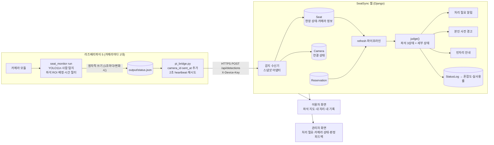
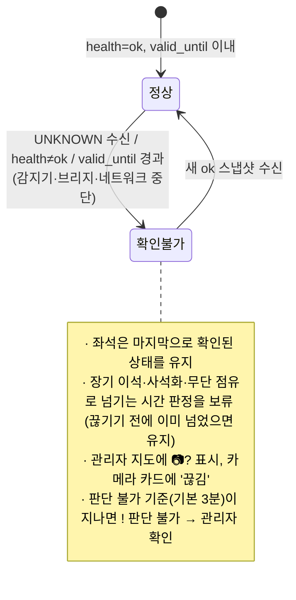

# 라즈베리파이 감지 프로토타입 ↔ SeatSync 웹 데이터 플로우

좌석별 사람 감지 프로토타입 [Seojieun05/SKKU_MakerHackerton](https://github.com/Seojieun05/SKKU_MakerHackerton)(`seat_monitor`)이
만든 결과를 SeatSync 웹이 받아 **예약 대조·처리 필요 판정·사전 경고·혼잡도 통계**에 쓰기 위한 설계와 구현이다.
프로토타입 코드는 **수정하지 않는다** — Pi에 브리지 스크립트 하나만 추가한다.

---

## 1. 프로토타입이 제공하는 것과 웹이 맞춰야 할 요구사항

| 프로토타입 (`seat_monitor`) | 웹에 필요한 대응 | 구현 |
|---|---|---|
| Pi 내부에서 YOLO11n으로 **사람만** 탐지, 좌석 다각형(ROI)에 배정 | 좌석별 결과만 받음 (영상·이미지 전송 없음) | `POST /api/detections` |
| 결과를 `output/status.json`에 원자적으로 쓰고 **네트워크 전송은 하지 않음** | Pi에서 파일을 읽어 웹으로 보내는 전송 계층 | `tools/pi_bridge.py` |
| 스냅샷 형식 `schema_version: 1` — `observed_at`, `valid_until`, `health`, `meaning`, `seats[]` | 형식을 **그대로** 받아들이는 수신기 | 스냅샷 어댑터 |
| 좌석 상태 `OCCUPIED` / `EMPTY` / `UNKNOWN` | 웹의 현장 상태(사람 있음/비어 있음/확인 불가)로 변환 | §4 매핑 |
| 좌석 ID는 `calibrate` 순서대로 `A01, A02…` (카메라마다 따로) | 카메라 ID + 좌석 ID → 웹 좌석(A-1…) 대응표 | `seats.json`의 `camera_id`·`camera_seat` |
| `EMPTY` = "사람 미검출" — **짐만 있는 자리도 EMPTY** (`meaning: person_presence_only`) | 짐을 못 보는 카메라의 EMPTY로 '짐만 있음'을 지우지 않기 | §4 규칙 E2 |
| README: *"`valid_until`이 지났거나 `health != "ok"`이면 **확인 불가**로 처리하라"* | 감지 확인 불가 처리 + 확인 불가 동안 시간 기반 판정 보류 | §5 |
| 시작·종료·오류 시 `UNKNOWN`, 추론이 느리면 `health: inference_too_slow` | UNKNOWN을 "빈자리"로 오해하지 않기 | §5 |
| `current_person_confidence`(탐지 점수, 빈자리 확률 아님) | 판정 피드백과 함께 저장 → 임계값(`--confidence`) 조정 근거 | 판정 정확도 카드 |
| 상태 전환 시간 필터(기본 착석 1초, 비움 8초), `state_duration_seconds` | 상태 시작 시각 복원 (`observed_at - state_duration_seconds`) | 수신기 |
| Pi 시계는 UTC ISO 8601로 기록 | Pi와 서버 시계 차이 보정 (단, 오래된 스냅샷과 구분) | 브리지의 `sent_at` |

---

## 2. 전체 구성



- 영상은 **Pi 밖으로 나가지 않는다.** 웹이 받는 것은 좌석 ID, 상태 문자열, 탐지 점수, 시각뿐이다.
- 카메라가 여러 대면 Pi(또는 프로세스)마다 브리지를 하나씩 실행하고 `--camera-id`만 다르게 준다.

---

## 3. 메시지 형식

### 3.1 Pi → 웹: `POST /api/detections`

헤더: `X-Device-Key: <디바이스 키>`, `Content-Type: application/json`
본문: **`status.json` 그대로** + 브리지가 붙이는 `camera_id`, `sent_at`

```json
{
  "schema_version": 1,
  "camera_id": "cam1",
  "sent_at": "2026-09-30T05:00:01.2+00:00",
  "observed_at": "2026-09-30T05:00:00+00:00",
  "valid_until": "2026-09-30T05:00:05+00:00",
  "health": "ok",
  "meaning": "person_presence_only",
  "seats": [
    {"seat_id": "A01", "state": "OCCUPIED", "has_person": true, "current_person_confidence": 0.9123,
     "pending_state": null, "state_duration_seconds": 12.3},
    {"seat_id": "A02", "state": "EMPTY", "has_person": false, "current_person_confidence": 0.0,
     "pending_state": null, "state_duration_seconds": 640.0}
  ]
}
```

응답:

```json
{"ok": true, "format": "snapshot_v1", "camera_id": "cam1", "health": "ok", "fresh": true,
 "accepted": 2, "ignored": [], "unknown": [], "missing": ["A03"], "clock_offset": 0,
 "server_time": "2026-09-30T14:00:01+09:00"}
```

| 필드 | 뜻 |
|---|---|
| `ignored` | 웹 대응표에 없는 카메라 좌석 ID (무시됨) |
| `missing` | 웹 대응표에는 있는데 스냅샷에 없는 좌석 → 확인 불가로 표시 (calibrate 설정 불일치) |
| `unknown` | 이번 스냅샷에서 확인 불가였던 좌석 |
| `fresh` | `health == "ok"` 이고 `valid_until`이 아직 지나지 않았는가 |

오류: `403 BAD_DEVICE_KEY`, `400 BAD_REQUEST`(camera_id 없음·형식 오류), `400 UNSUPPORTED_SCHEMA`.

### 3.1-b 짐 감지 (`python -m seat_monitor.items_run run`)

감지 저장소의 짐 감지 모듈은 위 스냅샷에 다음 필드를 더한다(사람 기준 `state`·`meaning`은 그대로).

| 위치 | 필드 | 웹에서 쓰는 방식 |
|---|---|---|
| 본문 | `item_meaning: "selected_personal_items"`, `item_classes` | 카메라가 짐 정보를 보내는지 표시 (판정 기준 화면 "카메라에서 짐 정보를 받고 있어요") |
| 좌석 | `has_item` (`true`/`false`/`null`) | `Seat.cam_item`에 저장. **[짐 감지] ON일 때만** 판정에 사용 |
| 좌석 | `current_item_confidence` | `Seat.cam_item_confidence` (관리자 상세 참고용) |
| 좌석 | `item_state`, `item_pending_state`, `presence_state` | 받기만 함 (`has_item`과 같은 뜻) |

판정 규칙 (관리자 탭 > 판정 기준 상단 **[짐 감지]** 스위치, 기본 OFF):

| 카메라 | OFF (사람 기준, 기존) | ON |
|---|---|---|
| `OCCUPIED` (+짐 유무 무관) | 사람 있음 | 사람 있음 + 짐이 있으면 관리자 지도에 노란 점 |
| `EMPTY` + `has_item: true` | 비어 있음 (단, 관리자가 지정한 '짐만 있음'은 유지) | **짐만 있음** → 체크인 좌석: 이석 → 장기 이석 기준 후 ! 이석(짐을 두고 자리 비움) / 입실 전: 빈자리 → 체크인 제한 후 ! 이석(미입실) / 예약 없음: 빈자리(노란 점만) |
| `EMPTY` + `has_item: false` | 비어 있음 | 비어 있음 (짐을 치운 경우 이석 시간은 이어서 셈) |
| `EMPTY` + `has_item: null` | 비어 있음 | 마지막 상태 유지 ('짐만 있음'이었으면 그대로) |

- 짐만 놓인 시점(비어 있음 → 짐만 있음)부터 시간을 새로 센다.
- 스위치를 끄면 카메라가 정한 '짐만 있음'은 '비어 있음'으로 돌아가고(시작 시각 유지), 관리자가 직접 지정한 '짐만 있음'은 그대로 둔다.
- 카메라 오류·유효 시간 초과면 `has_item`도 모름(null)으로 저장해 노란 점을 지운다.

> 짐까지 구분하는 차기 감지기를 위해 기존 `occupancy` 형식(`seat_no` + `person|item|empty`)도 같은 주소에서 계속 받는다.
> 본문에 `schema_version`이 있으면 스냅샷, 없으면 occupancy 형식으로 처리한다.

### 3.2 Pi → 웹: `GET /api/device/config?camera_id=cam1`

브리지가 시작할 때 호출해 **카메라 좌석 ID ↔ 웹 좌석** 대응을 확인한다(같은 디바이스 키 필요).

```json
{"camera_id": "cam1", "post_interval_sec": 2, "server_time": "...",
 "seats": [{"camera_id": "cam1", "camera_seat": "A01", "seat_no": 1, "label": "A-1", "zone": "왼쪽"}, ...]}
```

---

## 4. 좌석 대응과 상태 변환

### 4.1 대응표 (`config/seats.json`)

프로토타입의 `calibrate`는 좌석을 그린 순서대로 `A01, A02…`를 붙인다. 웹 좌석에 `camera_id`와 `camera_seat`를 적어 연결한다.

| 카메라 | calibrate 순서 → 웹 좌석 |
|---|---|
| `cam1` (8석) | A01~A04 → 왼쪽 **A-1 A-2 / A-3 A-4**, A05~A08 → 오른쪽 **B-1 B-2 / B-3 B-4** (각각 윗줄 왼→오, 아랫줄 왼→오) |

카메라를 더 달면 `seats.json`에 `cam2` 등을 추가하고 좌석마다 `camera_id`·`camera_seat`를 적는다.

**현장 작업 순서**: 카메라별로 위 순서대로 좌석 다각형을 그린다 → `pi_bridge.py --check --seats-config config/seats.json`으로
Pi 설정과 웹 대응표가 일치하는지 확인한다(불일치 좌석을 알려 줌). 대응을 바꾸려면 웹의 `seats.json`을 고치고 `python manage.py init_db`.

### 4.2 상태 변환 규칙 (수신기)

| # | 조건 | 웹 현장 상태 | 비고 |
|---|---|---|---|
| E1 | `OCCUPIED` | **사람 있음** | 상태 시작 = `observed_at − state_duration_seconds` |
| E2 | `EMPTY` + 사람만 보는 카메라 + 현재 '짐만 있음' | **짐만 있음 유지** | 짐을 못 보는 카메라의 EMPTY로 짐 표시를 지우지 않는다 |
| E3 | `EMPTY` (그 밖) | **비어 있음** | |
| E4 | `UNKNOWN`, 또는 `health != "ok"`, 또는 이미 지난 `valid_until` | 상태 **유지** + 확인 불가 표시 | "빈자리"로 오해하지 않는다 |
| E5 | 관리자가 '사용불가'로 지정한 좌석 | **덮어쓰지 않음** | 카메라 값은 기록만 |
| E6 | 같은 상태가 계속 들어옴 | 시작 시각·관리자 지정 의도 유지 | heartbeat |

### 4.3 판정 (예약과 대조)

현장 상태가 정해지면 웹의 순수 함수 `judge()`가 예약 기록과 대조해 세부 상태를 정한다.

| 예약 \ 카메라 | 사람 있음 (OCCUPIED) | 비어 있음 (EMPTY) |
|---|---|---|
| 없음 | 착석 감지 → 무단 점유 기준(기본 10분) 초과 시 ! **무단 점유** | 빈자리 |
| 입실 전 | 착석(체크인 전) → 10분 초과 시 ! **체크인 누락** | 입실 대기 → 체크인 마감 초과 시 ! **미입실** |
| 이용 중 (QR 체크인) | 정상 이용 | 일시 이석 → 장기 이석 기준(기본 30분) 초과 시 ! **장기 이석** (10분 전 본인 사전 경고) |

카메라가 `UNKNOWN`(가림·인식 실패·카메라 오류)이거나 수신이 끊기면 마지막 상태를 유지하다가, 판단 불가 기준(기본 3분)이 지나면
! **판단 불가**로 관리자 확인 목록에 올린다(§5). 관리자가 현장을 보고 실제 상태를 지정하면 카메라가 회복될 때까지 그 상태로 판정한다.

- **사석화**(짐만 두고 비움)는 사람만 보는 현재 카메라로는 직접 구분할 수 없다. 관리자가 좌석에 '짐만 있음'을 지정하면(E2)
  카메라의 EMPTY가 이를 지우지 않고, 장기 이석 기준 시간이 지나면 ! 이석 · 짐만 두고 자리 비움이 된다. 짐 감지 모듈(`items_run`)을 쓰고 [짐 감지]를 켜면 자동으로 판정한다(§3.1-b).
- 카메라의 비움 확정 시간(`--empty-seconds`)이 먼저 지난 뒤 웹의 장기 이석 기준이 시작된다. 실제 장기 이석 판정까지 = `empty-seconds + 장기 이석 기준`.

---

## 5. 신선도(확인 불가) 처리



| 중단 지점 | 웹에서 보이는 것 | 알게 되는 시간 |
|---|---|---|
| `seat_monitor` 종료·카메라 오류 | 마지막 스냅샷이 `UNKNOWN`/`stopped`/`error` → 즉시 확인 불가 | 다음 전송(≤2초) |
| `seat_monitor` 강제 종료·멈춤 (파일 갱신 중단) | 브리지가 오래된 스냅샷을 계속 보냄 → `valid_until`(기본 5초) 경과 | 약 5~7초 |
| 브리지 종료·Pi 전원·네트워크 끊김 | 수신이 끊겨 좌석의 `valid_until` 경과 | 약 5초 + 다음 화면 갱신 |
| 추론이 너무 느림 | `health: inference_too_slow` → 확인 불가 | 다음 전송 |

**시계 보정**: 브리지가 붙인 `sent_at`(Pi 시계로 전송 시각)과 서버 시각의 차이가 5초를 넘으면 그만큼 `observed_at`·`valid_until`을 보정한다.
`observed_at`으로 보정하지 않는 이유 — 멈춘 감지기의 오래된 스냅샷을 "Pi 시계가 느린 것"으로 오해해 새것처럼 만들어 버리기 때문이다.

---

## 6. 웹 기능별 데이터 사용

| 웹 기능 | 카메라 데이터가 쓰이는 곳 |
|---|---|
| 좌석 지도 3상태 | 현장 상태 + 예약 → 빈자리/사용중/사용불가 |
| 처리 필요(!) · 관리자 알림 | 무단 점유, 체크인 누락, 장기 이석(카메라), 사석화(관리자 지정 + 시간), 판단 불가(UNKNOWN 지속) |
| 본인 사전 경고 | 이용 중 좌석이 EMPTY로 바뀐 뒤 장기 이석 기준 10분 전 / 착석했는데 체크인 전 |
| 빈자리 알림 대기 | 좌석이 빈자리가 되는 순간 대기자에게 안내 |
| 혼잡도·실사용률 | StatusLog: 예약 점유 대비 **실제 착석(OCCUPIED)** 비율, 유휴 점유 |
| 판정 피드백·정확도 | 출처 `camera` 판정의 맞음/틀림 + 그때의 `current_person_confidence` → 임계값 조정 근거 |
| 카메라 연결 상태 카드 | Camera(health, 마지막 수신, 시계 차이) + 좌석별 A01→A-1 상태 |

---

## 7. Pi 설치·실행

### 7.1 브리지 설치
`tools/pi_bridge.py` 파일 하나를 Pi의 프로토타입 폴더에 복사한다(표준 라이브러리만 사용, 설치 불필요).

```bash
cd ~/SKKU_MakerHackerton
curl -O https://raw.githubusercontent.com/yugh27194/SeatSync/HEAD/tools/pi_bridge.py
# 연결·대응표 확인
python3 pi_bridge.py --check --url https://<웹 주소> --key <디바이스 키> --camera-id cam1 --seats-config config/seats.json
```

### 7.2 실행 (두 가지 중 하나)
```bash
# (A) 파일 감시 — seat_monitor와 따로 실행
python -m seat_monitor run --occupied-seconds 15 --empty-seconds 180 &
python3 pi_bridge.py --url https://<웹 주소> --key <디바이스 키> --camera-id cam1

# (B) 파이프 — 한 줄로
python -m seat_monitor run --occupied-seconds 15 --empty-seconds 180 | \
  python3 pi_bridge.py --stdin --url https://<웹 주소> --key <디바이스 키> --camera-id cam1
```

**권장 시간 필터(열람실)**: 프로토타입 기본값(착석 1초·비움 8초)은 잠깐 몸을 숙이거나 가려질 때도 상태가 바뀐다.
열람실에서는 `--occupied-seconds 15 --empty-seconds 180`(착석 15초, 비움 3분)을 권장한다 — 웹의 장기 이석 기준(30분)과 함께 쓰면
실제로는 약 33분 비었을 때 장기 이석으로 판정된다.

### 7.3 부팅 시 자동 실행 (systemd 예시)
```ini
# /etc/systemd/system/seat-monitor.service
[Unit]
Description=seat_monitor (person detection)
After=network-online.target
[Service]
User=pi
WorkingDirectory=/home/pi/SKKU_MakerHackerton
ExecStart=/home/pi/SKKU_MakerHackerton/.venv/bin/python -m seat_monitor run --occupied-seconds 15 --empty-seconds 180
Restart=always
[Install]
WantedBy=multi-user.target
```
```ini
# /etc/systemd/system/seatsync-bridge.service
[Unit]
Description=SeatSync bridge (status.json -> web)
After=network-online.target seat-monitor.service
[Service]
User=pi
WorkingDirectory=/home/pi/SKKU_MakerHackerton
Environment=SEATSYNC_DEVICE_KEY=<디바이스 키>
ExecStart=/usr/bin/python3 pi_bridge.py --url https://<웹 주소> --camera-id cam1
Restart=always
[Install]
WantedBy=multi-user.target
```
`sudo systemctl enable --now seat-monitor seatsync-bridge`

### 7.4 장비 없이 연동 시험
Pi·카메라 없이도 프로토타입의 **실제 상태 로직(`SeatState`)과 출력 함수(`snapshot`, `write_json`)**로 status.json을 만들어
브리지 → 웹 흐름을 확인할 수 있다(개발 중 이 방식으로 정상 연결·감지기 중단 시 확인 불가 전환을 검증함).
단위 테스트: `tests/test_camera.py` (스냅샷 수신, 대응표, UNKNOWN 유지, 신선도, 시계 보정, 브리지 왕복).

---

## 8. 한계와 다음 단계

| 항목 | 현재 | 다음 단계 |
|---|---|---|
| 짐 감지 | `items_run`이 좌석별 `has_item` 전송(노트북·가방·핸드백·캐리어·컵·책). 웹은 [짐 감지] ON일 때 '짐을 두고 자리 비움' 자동 판정, 예약 없는 좌석의 짐은 노란 점만 | 컵·책 현장 감지 확인, 짐 주인 구분은 하지 않음(QR 체크인으로만 본인 확인) |
| 좌석 대응 | 웹 `seats.json`과 Pi `calibrate` 순서를 사람이 맞춤 | `/api/device/config`로 받은 좌석 목록을 calibrate 화면에 이름으로 표시 |
| 본인 확인 | 없음 (누가 앉았는지 모름) → 무단 점유자 본인 경고 불가 | 좌석 QR 체크인으로만 본인 확인 (설계상 얼굴 인식은 하지 않음) |
| 전송 보안 | 공용 디바이스 키 1개 | 카메라별 키, HTTPS 필수 |
